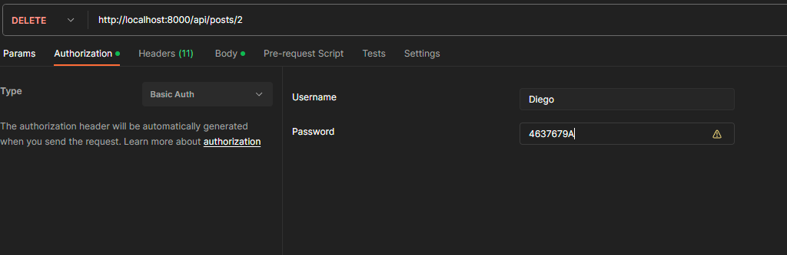

# Integrantes: Cardozo, Gonzalez, Mendizabal

# How to run the APP:
    pip install -r requirements.txt
    python manage.py runserver

Can manage CRUD operation on the Models at: 
http://127.0.0.1:8000/admin/

*Superuser*:
- Email:  admin@gmail.com
- User:   admin
- Pass:   admin

Can change the lenguaje of the admin page, in: ./settings.py > *LENGUAGE_CODE*

# API Documentation
Introduction
This documentation describes the available endpoints in the [your application name] API. The API allows for CRUD (Create, Read, Update, Delete) operations on "Post" and "Comment" objects.

Base URL
The base URL of the API is: http://yourdomain.com/api/

# Endpoints Posts

## Get All Posts
URL: /posts/
Method: GET
Description: Retrieves a list of all Posts in the database.
Requires Authentication: Yes
Successful Response: HTTP Status Code 200 OK
Successful Response (example):
[
    {
        "id": 1,
        "userId": 1,
        "title": "Post Title",
        "info": "Post Content",
        "creation_date": "2023-11-09T10:00:00Z"
    },
    {
        "id": 2,
        "userId": 1,
        "title": "Another Title",
        "info": "Another Content",
        "creation_date": "2023-11-09T11:00:00Z"
    }
]

## Create a New Post
URL: /posts/
Method: POST
Description: Creates a new Post in the database.
Requires Authentication: Yes
Required Parameters:
userId (int): ID of the user creating the Post.
title (string): Title of the Post.
info (string): Content of the Post.
Successful Response: HTTP Status Code 201 Created
Successful Response (example):
{
    "id": 3,
    "userId": 1,
    "title": "New Title",
    "info": "New Content",
    "creation_date": "2023-11-09T12:00:00Z"
}

## Get a Post by ID
URL: /posts/{id}/
Method: GET
Description: Retrieves a Post by its ID.
Requires Authentication: Yes
Successful Response: HTTP Status Code 200 OK
Successful Response (example):
{
    "id": 1,
    "userId": 1,
    "title": "Post Title",
    "info": "Post Content",
    "creation_date": "2023-11-09T10:00:00Z"
}

## Update a Post by ID
URL: /posts/{id}/
Method: PUT
Description: Updates a Post by its ID.
Requires Authentication: Yes
Required Parameters:
title (string): New title for the Post.
info (string): New content for the Post.
Successful Response: HTTP Status Code 200 OK
Successful Response (example):
{
    "id": 1,
    "userId": 1,
    "title": "New Title",
    "info": "New Content",
    "creation_date": "2023-11-09T10:00:00Z"
}

## Delete a Post by ID
URL: /posts/{id}/
Method: DELETE
Description: Deletes a Post by its ID.
Requires Authentication: Yes
Successful Response: HTTP Status Code 204 No Content

# Comments

## Get All Comments for a Post
URL: /posts/{postId}/comments/
Method: GET
Description: Retrieves a list of all Comments related to a Post.
Requires Authentication: Yes
Successful Response: HTTP Status Code 200 OK
Successful Response (example):
[
    {
        "id": 1,
        "userId": 1,
        "postId": 1,
        "comment": "Example comment"
    },
    {
        "id": 2,
        "userId": 1,
        "postId": 1,
        "comment": "Another comment"
    }
]

## Create a New Comment on a Post
URL: /posts/{postId}/comments/
Method: POST
Description: Creates a new Comment on a Post.
Requires Authentication: Yes
Required Parameters:
userId (int): ID of the user creating the Comment.
comment (string): Content of the Comment.
Successful Response: HTTP Status Code 201 Created
Successful Response (example):
{
    "id": 3,
    "userId": 1,
    "postId": 1,
    "comment": "New comment"
}

## Get a Comment by ID
URL: /comments/{id}/
Method: GET
Description: Retrieves a Comment by its ID.
Requires Authentication: Yes
Successful Response: HTTP Status Code 200 OK
Successful Response (example):
{
    "id": 1,
    "userId": 1,
    "postId": 1,
    "comment": "Example comment"
}

## Update a Comment by ID
URL: /comments/{id}/
Method: PUT
Description: Updates a Comment by its ID.
Requires Authentication: Yes
Required Parameters:
comment (string): New content for the Comment.
Successful Response: HTTP Status Code 200 OK
Successful Response (example):
{
    "id": 1,
    "userId": 1,
    "postId": 1,
    "comment": "Updated comment"
}

## Delete a Comment by ID
URL: /comments/{id}/
Method: DELETE
Description: Deletes a Comment by its ID.
Requires Authentication: Yes
Successful Response: HTTP Status Code 204 No Content

# Authentication
You have to put ur credentials on the Authorization panel of postman (expample):

